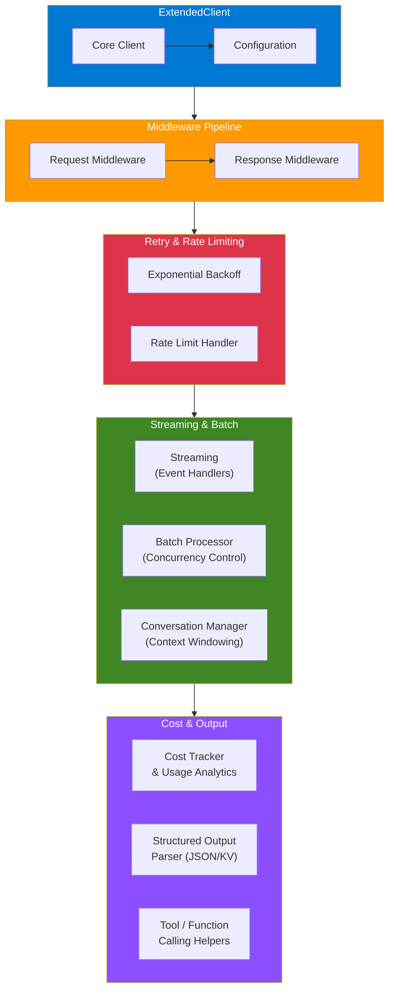

# claude-python-sdk-extended

Extended Python SDK with retry logic, middleware, streaming, batch processing, conversation management, structured output parsing, and cost tracking.

## Architecture



## Features

- Automatic retry with exponential backoff and rate limit handling
- Middleware pipeline for request/response processing
- Streaming support with event handlers
- Batch processing with concurrency control
- Multi-turn conversation management with context windowing
- Structured output parsing (JSON, lists, key-value)
- Cost tracking and usage analytics
- Tool/function calling helpers

## Installation

```bash
pip install claude-sdk-extended
```

## Quick Start

```python
from claude_sdk_extended import ExtendedClient

client = ExtendedClient(api_key="your-key")

response = client.complete("Explain Kubernetes in one sentence.")
print(response)
```

## License

MIT Licensed. See [LICENSE](LICENSE) for details.
